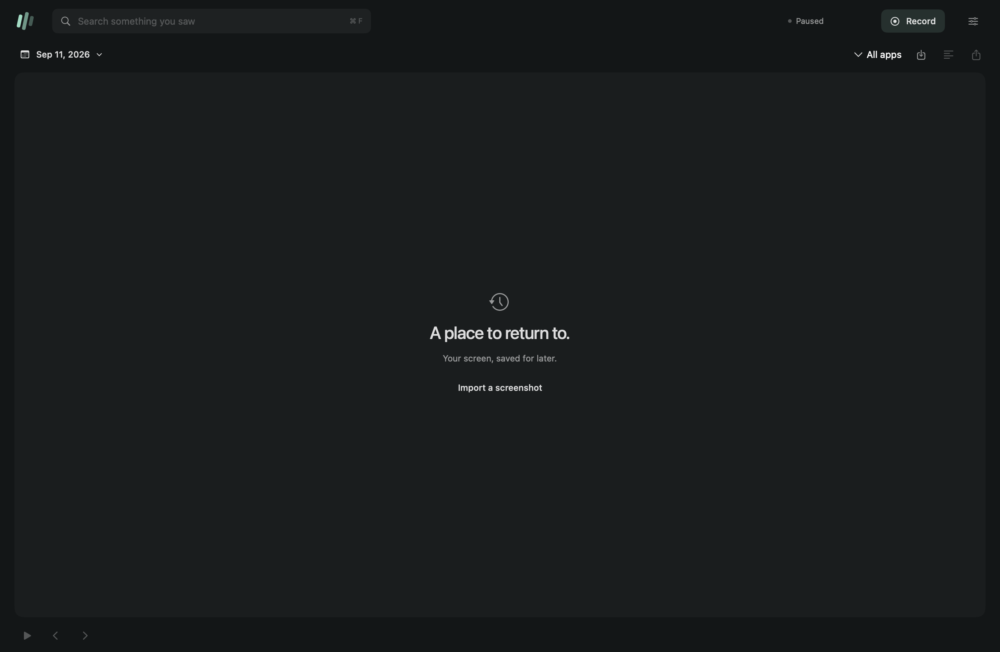

# Afterimage guide

For the short introduction and example workflows, see the [README](README.md).

A native SwiftUI screen-memory app for macOS, with a C++20 archive engine and a CLI for agents. Find something you saw, open the screenshot, and browse the moments around it.

Afterimage samples the selected display (the main display by default), reads visible text with Apple's on-device Vision framework, and stores searchable screenshots on your Mac. Recording is off on launch. There are no accounts, network services, API keys, or bundled activity records.

## Build and run

Requires **macOS 14 or newer**, Apple Command Line Tools with Swift 6, CMake 3.20+, and Python 3 for the integration test. The system SQLite library must include FTS5 (macOS does).

```sh
./scripts/build.sh
./afterimage
```

Install the app and terminal launcher:

```sh
./scripts/install.sh
# App: ~/Applications/Afterimage.app
# CLI: ~/.local/bin/afterimage
```

Click **Start recording**. On first use, grant Afterimage access in **System Settings → Privacy & Security → Screen & System Audio Recording**, then restart the app. Switch to another application; Afterimage deliberately does not capture while its own interface is focused. Permission is never required for importing screenshots or searching the archive.

The build uses an available Apple Development signing identity, with ad-hoc signing as a fallback. Developer ID distribution and notarization are not included. This build is intended for local use; rebuilding or changing its installed location may require macOS permission to be granted again.

## Using the app



- Search visible text or window titles. Search terms are literal words combined with AND, not a query language. Results are chronological, not AI-generated answers.
- Choose a date and application. **Earlier / Newer** page through the entire matching archive in batches of 200.
- The window uses one integrated header and an edge-to-edge canvas. Use the stack button to reveal thumbnails; the calendar and import/export menu sit beside playback controls.
- App icons appear on the selected frame, thumbnails, timeline markers and app exclusions. Icons come from installed applications matched by bundle ID; imports and unavailable apps use neutral symbols.
- Select a result to see the screenshot and highlighted OCR boxes. Open **Details** for the recognized text, source, dimensions and timestamp.
- Scrub the application timeline or use the arrow keys. Space plays saved moments at a fixed step rate; it is **not a continuous video or real-time reenactment**. Gaps remain visible.
- Zoom, export an image, or delete an individual moment.
- Import PNG/JPEG screenshots to test the pipeline without recording. Imports are explicitly labeled and dated at import time. The CLI can set a supplied capture timestamp.
- Set the capture interval, history retention and excluded app bundle IDs in Settings. Delete all history there, or reveal the archive in Finder.

The macOS menu bar indicates whether recording is enabled and provides pause/resume. Closing the main window pauses recording; the menu-bar app remains available. Recording also pauses on screen sleep, system sleep or session deactivation. It does not automatically resume after those events.

## What gets captured

The default sampling interval is **2 seconds** (configurable from 1–30 seconds). Each candidate is compared with the last saved image through a C++ change gate:

1. App or window-title changes save a fresh sample.
2. A 160×90 grayscale comparison selects frames with sufficient visual change.
3. Unchanged screens receive a checkpoint after 30 seconds.
4. Only one capture/OCR job can be in flight, so slow OCR causes skipped sampling opportunities rather than an unbounded queue.
5. Excluded application windows are filtered from the capture. If an excluded app is focused, capture waits entirely. Afterimage always excludes itself.
6. OCR runs off the UI thread. Before saving, the app checks that recording is still enabled, the capture generation is current, and the focused app is not excluded.

This is periodic capture with change-based saving, not a guarantee that every screen change is preserved. Small changes may be missed. OCR can misread text; inspect the screenshot for evidence. Capture includes visible content from other non-excluded windows on that display. Browser private tabs and sensitive content are not automatically detected; exclude the browser or pause recording as appropriate.

No microphone or audio is captured. The current release does not capture accessibility trees, browser URLs, multiple displays simultaneously, or semantic embeddings. It provides full-text search, not chat.

## Terminal interface

All commands return JSON and work without the app running. The CLI uses the same C++ archive and SQLite database as the desktop app; it does not scrape the UI.

```sh
afterimage --help
afterimage doctor
afterimage stats
afterimage optimize
afterimage compact
afterimage list --limit 20
afterimage search 'sensor calibration' --app com.apple.Safari
afterimage search 'localization' --from 1789084800 --to 1789171200
afterimage frame 12
afterimage import ~/Desktop/screenshot.png
afterimage export 12 ~/Desktop/moment.jpg
afterimage delete 12
afterimage prune 14
```

`--from` is inclusive and `--to` exclusive; both accept Unix seconds. Frame timestamps are stored in Unix seconds and displayed in the Mac's local timezone. `list` and `search` accept `--app`, `--from`, `--to`, `--limit` (maximum 1000) and `--offset`. CLI export refuses to overwrite an existing file. Failures return a nonzero exit status and a JSON error on stderr.

Use `AFTERIMAGE_HOME=/path/to/archive` for an isolated archive. The default is `~/Library/Application Support/Afterimage`. The database uses WAL mode and a busy timeout for concurrent app/CLI access. Directory permissions are restricted to the current user. Data is not independently encrypted by Afterimage; OS disk encryption is separate.

## Use with an agent

The portable skill lives at [skills/afterimage/SKILL.md](skills/afterimage/SKILL.md). It follows the [Agent Skills format](https://agentskills.io/specification): a folder with a capitalized `SKILL.md`, YAML `name` and `description`, and instructions for querying the archive.

First install the app and CLI with `./scripts/install.sh`. Check that `afterimage --help` works in your agent's terminal; the installer places the launcher in `~/.local/bin`, which must be on its `PATH`.

For Codex, copy the skill from the repository root:

```sh
mkdir -p "${CODEX_HOME:-$HOME/.codex}/skills/afterimage"
cp skills/afterimage/SKILL.md "${CODEX_HOME:-$HOME/.codex}/skills/afterimage/SKILL.md"
```

Start a new agent session so it can discover the skill. For another Agent Skills-compatible client, copy the `skills/afterimage` folder into that client's skill directory. The destination depends on the client. An agent without skill discovery can still read `SKILL.md` when you give it the file, provided it has local terminal access.

Try asking:

> Use Afterimage to find the Hugging Face passage I read today. Show me the capture time and the matching text.

Or:

> Use Afterimage to review my week. Suggest one workflow improvement and cite the frames behind it.

The skill teaches the agent to search and inspect evidence; it does not add a chat model to Afterimage. A remote chat window cannot read your Mac by itself. When a cloud agent reads archive results, that content enters its conversation.

## Engineering

| Component | Implementation |
|---|---|
| Archive, filters, FTS queries, preferences, retention | C++20 + SQLite FTS5 |
| Change selection | C++ grayscale comparison and timestamp/context checkpoints |
| Capture | ScreenCaptureKit through Objective-C++ |
| Text extraction | Apple Vision; normalized OCR rectangles retained |
| Desktop shell | SwiftUI views, Observation state and Swift 6 concurrency |
| App/engine bridge | Small Objective-C++ adapter connecting SwiftUI to C++; no HTTP server |
| Screenshot delivery | SwiftUI image canvas with screenshot-linked OCR highlights |
| CLI | Same native executable and C++ engine |

Clang, SQLite, Vision and ScreenCaptureKit supply foundational capabilities; this project implements their integration, archive behavior, change gate, query workflow and UI. It does not claim a new OCR model or search algorithm.

See [architecture and decisions](docs/ARCHITECTURE.md) and [validation](docs/VALIDATION.md).

## Tests and package

```sh
./scripts/build.sh                 # C++ tests + native OCR/CLI integration
./scripts/package.sh               # dist/Afterimage-macOS.zip
python3 tests/native_ui.py          # SwiftUI checks; logged-in Mac required
```

The C++ core can also be built and tested on Linux. Native capture, OCR and the app require macOS. CI definitions are included; a workflow file is not evidence that hosted CI has run.

Keyboard shortcuts: **⌘F** or **/** focuses search; **← / →** browses moments; **Space** toggles playback; **⌘,** opens Settings. The app follows the system light/dark appearance.

The generated document in `tests/fixture.png` is explicitly labeled test content and is never inserted into the user's archive automatically. To exercise the native UI with an isolated archive:

```sh
export AFTERIMAGE_HOME="$(mktemp -d)"
./afterimage import tests/fixture.png
./build/Afterimage.app/Contents/MacOS/Afterimage --ui-smoke /tmp/afterimage-ui
# JSON check results and a native SwiftUI screenshot:
# /tmp/afterimage-ui.json and /tmp/afterimage-ui.png
```

`--ui-smoke` opens a test window, exercises SwiftUI state and C++ archive operations, writes results, then exits. It never starts recording. [scripts/draw-assets.swift](scripts/draw-assets.swift) regenerates the icon and OCR fixture.

## License

MIT. The vendored nlohmann/json header retains its own MIT license. See [THIRD_PARTY.md](THIRD_PARTY.md).

First launch shows a standalone setup window. Grant Screen Recording permission, then press Start recording to enter the timeline. The main interface is hidden until setup succeeds. Timeline segments have consistent app colors. Mouse-wheel and trackpad scrolling selects earlier or later frames. Open the gear for Capture, Privacy, and Storage settings; Capture also lets you replay the introduction.

Settings opens in its own native window. Capture, Privacy, and Storage changes save automatically. Storage reports total archive size plus screenshot and database usage. Scrolling over the timeline advances saved frames (vertical mouse wheel or horizontal trackpad); the timeline keeps the selection visible.

The build prefers the installed Xcode toolchain and passes its SDK explicitly to Swift. On this Mac it now uses Swift 6.3.3 and the macOS 26.5 SDK, enabling native Liquid Glass on macOS 26.

The timeline fits the full loaded range: consecutive samples from the same app are merged into continuous bands, recording gaps remain empty, and app icons are spaced to avoid overlap. Mouse and trackpad scrolling changes the selected frame without panning the track.

## Storage

Balanced mode stores recordings in short HEVC chunks, with lossless staging until a chunk is committed. C++ owns batching, metadata, retention, recovery and cache accounting; Apple's native encoder and decoder handle media. Search uses the original OCR text and timestamps. Settings → Capture offers Balanced, Sharper and Keep JPEG images. Existing video chunks are not repeatedly recompressed when quality settings change.

Run `afterimage compact` to compress an older archive or finalize pending frames. It preserves every moment but HEVC is lossy. Keep a backup before migration. `afterimage optimize` remains available for byte-identical still-image sharing. Export through the CLI or app rather than assuming each moment has a JPEG file.

`stats` separates `videoBytes`, `stillBytes`, `cacheBytes`, `workingBytes` and total `diskBytes`. Totals use file byte sizes with hard links counted once, not filesystem allocated blocks; external backups are not included. Preview files are bounded at eight / approximately 32 MiB; the decoded image cache has an advisory 64 MiB cost limit. Pending input batches close at 30 frames or approximately 32 MiB, allowing one oversized image.

Whole-chunk retention deletes media directly. A selective deletion preserves its surviving frames as PNGs and removes the old chunk; this can increase storage for that chunk but avoids leaving deleted pixels in a video or repeatedly degrading survivors.

Measured on 182 moments: 67.7 MB originally, 56.5 MB after exact sharing, **13.4 MB with Balanced HEVC**, excluding generated previews. See the [HEVC results and limitations](docs/hevc-storage.md) and the earlier [lossless optimization report](docs/storage-optimization.md).
